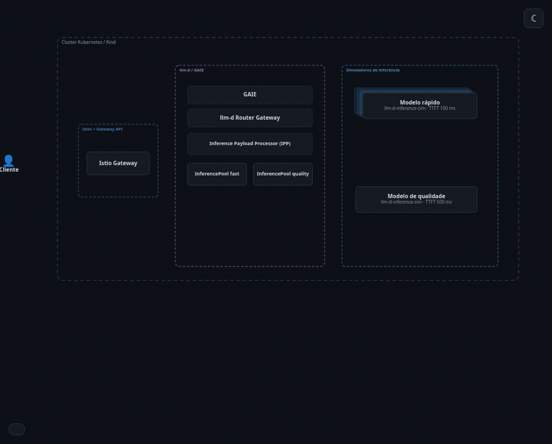
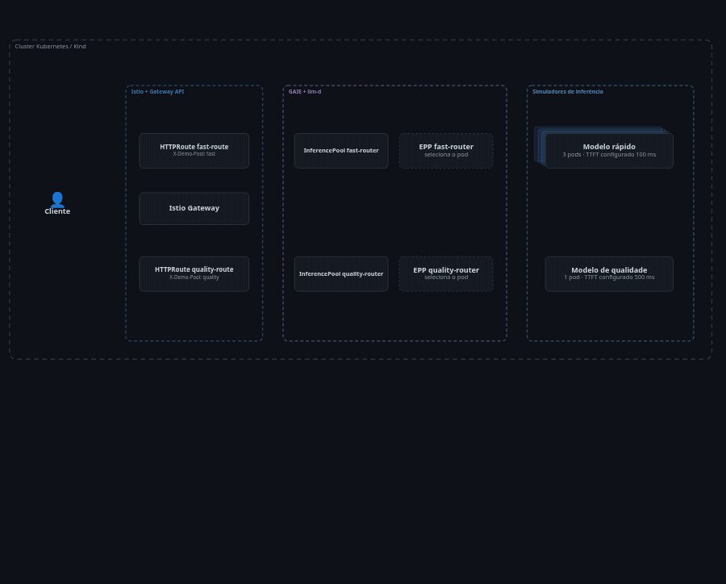
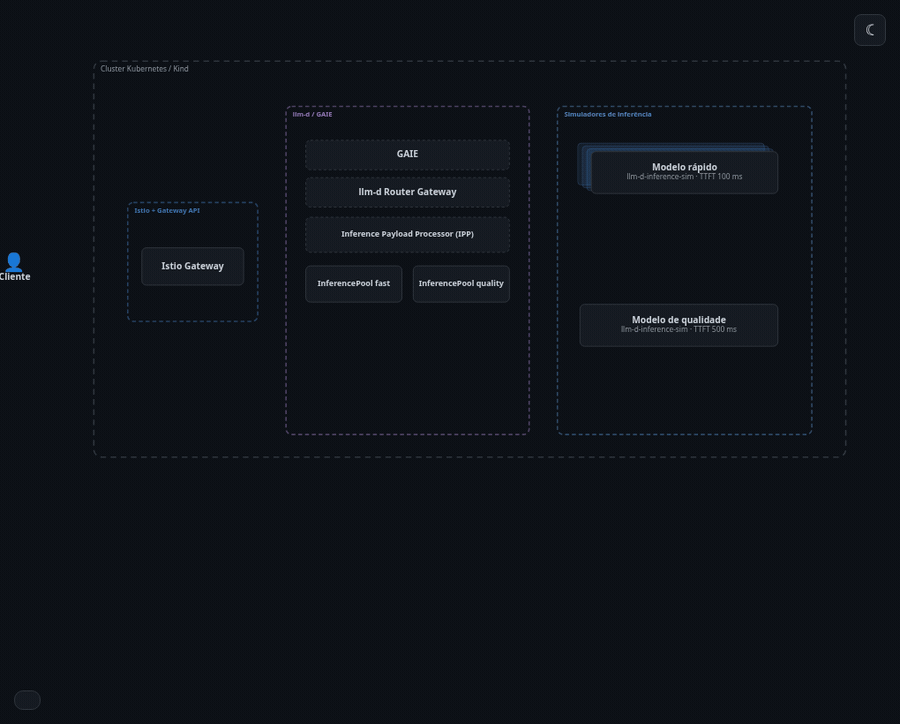

# KCD Brasil 2026: networking para IA

Demo local de inferência com Istio, Gateway API, GAIE, `InferencePool` e llm-d.

## Demo independente de DRA

Para o passo a passo, limites, mapa de manifests e comandos de inspeção, veja
a [documentação da demo DRA/DRANET](docs/dra-demo.md).

A demo DRA usa um Kind próprio (`kind-dra-demo`) com Kubernetes 1.37,
o `dra-example-driver` oficial e GPUs mock. Ela não altera a demo de inferência.

O driver pronto é a imagem pública
`registry.k8s.io/dra-example-driver/dra-example-driver:v0.3.0`; não há Go de
driver neste repositório. O fluxo usa `DeviceClass`, `ResourceClaimTemplate` e os
dois Pods `dra-consumer-a` e `dra-consumer-b`.

```bash
make dra-driver
make dra-workload
make validate-dra-demo
```

`dra-driver` cria o Kind e instala somente o driver GPU. `dranet-driver` instala
o DRANET separadamente. `dra-workload` e `dranet-workload` aplicam o mesmo
manifesto combinado, com apenas dois Pods, um em cada worker; cada Pod pede
uma GPU mock e uma interface DRANET.

A validação confirma o `ResourceSlice`, a alocação no `ResourceClaim` gerado e
as variáveis `GPU_DEVICE_*` no Pod. Para usar outra imagem de nó Kind, defina
`KIND_NODE_IMAGE=kindest/node:v1.37.0` (ou uma versão compatível).

Os DaemonSets do driver GPU e do DRANET usam afinidade para executar somente
nos workers; os `ResourceSlice` desta demo são publicados apenas nesses nós.

### Extensão opcional: DRANET sem RDMA

O fluxo detalhado de objetos, alocação e inspeção está em
[`docs/dra-demo.md`](docs/dra-demo.md).

A extensão instala o [DRANET oficial](https://github.com/kubernetes-sigs/dranet),
cria interfaces dummy nos dois workers Kind e aloca uma por Pod:

```bash
make dranet-driver
make dranet-workload
make validate-dranet-demo
```

Para ensaiar a inspeção completa no terminal e gravá-la para reprodução:

```bash
bash scripts/rehearse-dra-demo.sh
asciinema rec docs/dra-demo.cast -c 'DRA_COLOR=1 bash scripts/rehearse-dra-demo.sh'
asciinema play docs/dra-demo.cast
```

O roteiro só usa `kubectl get`, `describe` e `exec`; não aplica nem remove
recursos. O cast é um artefato local de gravação, não um arquivo versionado.

O driver usa a imagem publicada `registry.k8s.io/networking/dranet:stable`;
não há Go neste repositório. Os Pods exibem `ip addr`, `dranet0` e os endereços
`169.254.10.1/30` e `169.254.10.2/30`. O script
[`create-dranet-dummy.sh`](scripts/create-dranet-dummy.sh) usa `docker exec`
para criar `dranet-dummy0` no primeiro worker e `dranet-dummy1` no segundo antes
da instalação do DRANET; o driver move as interfaces para os Pods correspondentes. A
validação mostra `dranet0`, os endereços e os claims, sem Service ou tráfego
entre os dummies.

Esse caminho exige Linux, Docker com containers Kind privilegiados e a
ferramenta `ip`. As interfaces dummy não formam um enlace entre os Pods; a
extensão continua sem RDMA ou promessa de desempenho.

Os manifests estão em [`k8s/dra/driver.yaml`](k8s/dra/driver.yaml),
[`k8s/dra/workload-combined.yaml`](k8s/dra/workload-combined.yaml) e o cluster em
[`k8s/dra/kind.yaml`](k8s/dra/kind.yaml).

O `DeviceClass` DRANET está em [`k8s/dra/network-driver.yaml`](k8s/dra/network-driver.yaml).
Fontes:
[instalação DRANET](https://github.com/kubernetes-sigs/dranet#installation) e
[alocação DRA no Kubernetes](https://kubernetes.io/docs/tasks/configure-pod-container/assign-resources/allocate-devices-dra/).

## Modelo rápido

Modelo simulado com TTFT menor, atendido por três réplicas no pool `fast`, para evidenciar o balanceamento.



## Modelo de qualidade

Modelo simulado com TTFT maior, atendido pelo pool separado `quality`, para evidenciar a seleção de pools.



## Pool inválido

Um valor de `X-Demo-Pool` diferente de `fast` ou `quality` não corresponde a nenhuma rota e não alcança um `InferencePool`.



## Gerar os diagramas

Use o [FlowStory](https://github.com/noyitz/flowstory). Consulte o [guia rápido](https://github.com/noyitz/flowstory/blob/main/docs/quick-start-prompt.md) e a [referência do schema](https://github.com/noyitz/flowstory/blob/main/CLAUDE.md).

1. Abra `docs/architecture/diagram.json` no FlowStory.
2. Exporte um GIF para cada fluxo: `fast_happy_path`, `quality_happy_path` e `invalid_pool`.
3. Salve-os em `docs/diagrams/` como `flow-fast_happy_path.gif`, `flow-quality_happy_path.gif` e `flow-invalid_pool.gif`.

O JSON é a fonte do diagrama; não há arquivos D2 ou SVG para manter.

## Pré-requisitos

- Docker, Kind v0.33.x, `kubectl` e Helm
- No Linux: `fs.inotify.max_user_instances >= 512`

```bash
sudo sysctl -w fs.inotify.max_user_instances=512
```

`make dra-driver` (e `make dra-demo`) bloqueia antes de criar o cluster se o
binário `kind` não existir ou se `kind version` não for 0.33.x.

## Preparar a demo

Com internet, crie o cache e carregue as imagens no Kind:

```bash
make prepare-offline
```

Em seguida, faça o ensaio usando somente o cache:

```bash
OFFLINE=1 make model-routing
```

Isso instala o Gateway Istio, três simuladores `fast` (TTFT de 100 ms), um `quality` (TTFT de 500 ms) e um `InferencePool` para cada modelo, sem baixar manifests, charts ou imagens.

## Validar

```bash
make validate-model-routing
```

O cliente envia uma API OpenAI-compatível para `/v1/chat/completions`. `X-Demo-Pool: fast|quality` seleciona o `InferencePool`; a validação mostra os pods, `usage` e exige TTFT de `fast` menor que o de `quality`.

## Ensaio offline

Prepare o cache e o cluster antes da palestra. No palco, rode somente:

```bash
make rehearse-offline
```

Esse comando não instala charts, aplica manifests nem baixa imagens.

## Decisão

[ADR-002](docs/adr/0002-uma-demo-kubernetes-com-istio.md) registra o escopo da demonstração.
