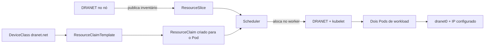

# Demo de DRA e DRANET

Esta demo mostra como o Kubernetes aloca recursos gerenciáveis por DRA sem
usar GPU física, RDMA ou uma rede real. Ela mantém um cluster KinD separado da
demo de inferência e executa dois fluxos independentes:

- `dra-example-driver`: GPU mock em cada worker, nunca no control-plane;
- DRANET: uma interface Linux `dummy` em cada worker, apenas para mostrar
  descoberta, seleção, alocação e configuração com `ip addr`.

As interfaces `dummy` não possuem peer. Portanto, a demo não promete
conectividade entre os Pods.

## O fluxo de alocação



O significado de cada objeto é:

1. O DRANET, restrito aos workers, descobre `dranet-dummy0` e `dranet-dummy1` e
   publica esses devices em `ResourceSlice`; não há `ResourceSlice` de DRA no
   control-plane.
2. `DeviceClass dranet.net` seleciona devices cujo driver é `dra.net`.
3. Cada `ResourceClaimTemplate` pede um nome de interface específico e define
   `dranet0` e um endereço IP.
4. Ao criar o Pod, o Kubernetes gera o `ResourceClaim` correspondente.
5. O scheduler escolhe um worker que possui o device solicitado e registra a
   alocação em `status.allocation`.
6. O kubelet chama o DRANET; o driver move a interface para a network namespace
   do Pod e aplica a configuração declarada no claim.
7. O container consegue observar a interface com `ip addr`.

## Objetos desta implementação

| Arquivo | Função |
| --- | --- |
| `k8s/dra/kind.yaml` | control-plane e dois workers KinD |
| `k8s/dra/driver.yaml` | `DeviceClass` e DaemonSet do `dra-example-driver` |
| `k8s/dra/network-driver.yaml` | `DeviceClass dranet.net` |
| `k8s/dra/workload-combined.yaml` | quatro templates e dois Pods, cada um com GPU e rede |
| `scripts/create-dranet-dummy.sh` | cria os devices dummy nos workers |
| `scripts/install-dranet-demo.sh` | prepara dummies e instala DRANET |
| `scripts/apply-dranet-workload.sh` | aplica os Pods e claims |
| `scripts/validate-dranet-demo.sh` | verifica slices, claims e interfaces |

## Executar

```bash
make dranet-driver
make dranet-workload
make validate-dranet-demo
```

O alvo `make dranet-demo` executa os dois primeiros alvos em sequência.

## Inspecionar a alocação

```bash
kubectl --context kind-dra-demo get nodes -o wide
kubectl --context kind-dra-demo -n kube-system get pods -l app=dranet -o wide
kubectl --context kind-dra-demo get resourceslices -o yaml
kubectl --context kind-dra-demo get deviceclasses
kubectl --context kind-dra-demo -n dra-demo get resourceclaims -o yaml
kubectl --context kind-dra-demo -n dra-demo get pods -o wide
kubectl --context kind-dra-demo -n dra-demo exec dra-consumer-a -- ip addr
kubectl --context kind-dra-demo -n dra-demo exec dra-consumer-b -- ip addr
```

Nos claims, procure `status.allocation` e `networkData`. Nos Pods, procure a
interface `dranet0` e os endereços `169.254.10.1/30` e `169.254.10.2/30`.

## Roteiro gravável no terminal

O roteiro somente consulta o cluster e executa comandos de leitura dentro dos
dois Pods. Ele mostra, em etapas com títulos em português e pausas curtas, o
YAML de `DeviceClass`, `ResourceClaimTemplate`, `ResourceClaim` (incluindo
`status.allocation` e `status.networkData`) e `ResourceSlice`, além dos Pods,
`GPU_DEVICE_*` e `ip addr`. Ele não cria, aplica ou remove recursos:

```bash
bash scripts/rehearse-dra-demo.sh
```

Campos importantes aparecem em vermelho e negrito durante a execução em um
terminal ou gravação asciinema. Use `NO_COLOR=1 bash scripts/rehearse-dra-demo.sh`
para uma saída sem ANSI (também usada automaticamente em redirecionamentos).

Para gravar e reproduzir a sessão com [asciinema](https://asciinema.org/):

```bash
asciinema rec docs/dra-demo.cast -c 'DRA_COLOR=1 bash scripts/rehearse-dra-demo.sh'
asciinema play docs/dra-demo.cast
```

O arquivo `docs/dra-demo.cast` é gerado localmente durante a gravação e não é
versionado neste repositório.

## Limites

Uma interface `dummy` é um dispositivo virtual local. Configurar um endereço
ou uma rota no `ResourceClaim` não cria um enlace entre workers. Comunicação
real exigiria um dispositivo com peer, como `veth`, ou uma interface `ipvlan`
ligada a uma rede existente; isso não faz parte desta demo.
